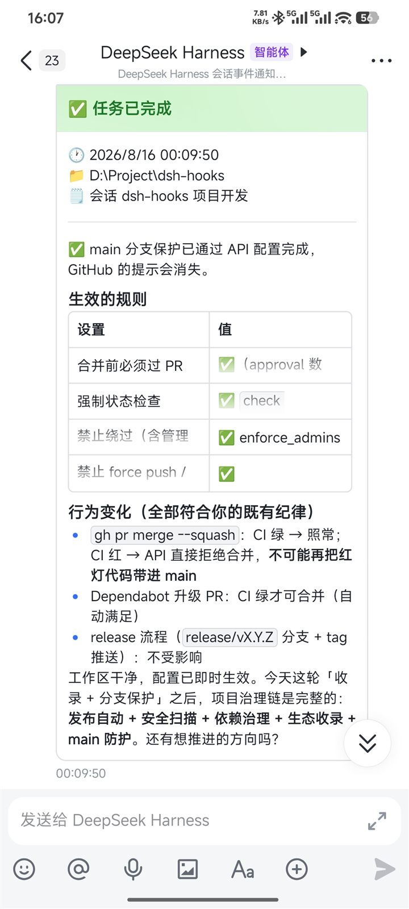

# dsh-hooks

[DeepSeek Harness](https://github.com/deepseek-ai/deepseek-harness)（dsh）的配置驱动生命周期 hooks 插件。

直接在 profile 的 `cordis.patch.yml` 里声明「事件 → 命令」——就像 Codex CLI / OpenCode 的 hooks，但属于 dsh。不需要写插件代码。

[English](README.md) | [设计](#设计) | [飞书示例](examples/notify-feishu.mjs)

## 安装

一个包搞定全部（hook 引擎 + Web GUI 设置页）：

```sh
dsh plugin --profile web add dsh-hooks           # 从 npm 安装
# 或直接从 git 安装：
dsh plugin --profile web add github:PeterBon/dsh-hooks
```

重启 `dsh web` 生效。安装后设置面板里会出现「Hooks」分区（见 [Web GUI](#web-gui)）。

## 配置

在你的 profile 的 `cordis.patch.yml` 里添加配置块：

```yaml
- id: dsh-hooks
  name: dsh-hooks
  config:
    hooks:
      - on: 'turn/end'
        when: 'completed'            # 可选：只在回合正常完成时触发
        run: 'node examples/notify-feishu.mjs'
        timeoutMs: 10000             # 可选，默认 10000
      - on: 'approval/asked'
        run: 'powershell -Command "Add-Content hooks.log approval-requested"'
      - on: 'tool/call'
        match:                       # 可选：字段 → 正则，全部匹配才触发
          tool: '^(rm|git|ssh)'
        run: 'node examples/notify-webhook.mjs --slack'
      - on: 'turn/end'
        when: 'completed'
        run: 'node examples/notify-feishu.mjs'
        retries: 2                   # 可选：非零退出码重试（默认 0 不重试）
        retryDelayMs: 1000           # 可选：重试基础间隔，每次翻倍（默认 500）
      - on: 'turn/end'
        input: 'stdin'               # 可选：把完整上下文 JSON 写入命令 stdin
        run: 'node my-hook.mjs'
      - on: 'approval/asked'
        notify:                      # 内置通知：与 run 二选一，无需外部脚本
          channel: 'desktop'         # 桌面气泡/toast 通知
      - on: 'turn/end'
        when: 'completed'
        notify:
          channel: 'webhook'         # POST JSON 到任意 HTTP 端点
          url: 'https://hooks.slack.com/services/…'
          slack: true                # 可选：改为 { text } 单行摘要（Slack 风格）
```

每个 hook 的完整字段：

| 字段 | 含义 | 默认 |
| --- | --- | --- |
| `on` | 触发事件（见上方事件表） | 必填 |
| `when` | 对 `turn/end` 按结束原因过滤 | 全部原因 |
| `match` | 字段 → 正则，全部匹配才触发；字段为上下文键（`tool`/`sessionName`/`sessionId`/`error`/`source`/`cwd`/`content`/`reason`…），上下文中不存在的字段视为不匹配 | 不过滤 |
| `run` | 通过系统 shell 执行的命令（与 `notify` 二选一） | 二选一必填 |
| `notify` | 内置通知（与 `run` 二选一）：`channel: webhook`（HTTP JSON，`url` 可省略用 `DSH_HOOKS_WEBHOOK_URL`，`slack: true` 换单行摘要）或 `channel: desktop`（系统气泡/toast） | 二选一必填 |
| `input` | `env` 只传 `DSH_HOOK_*` 环境变量；`stdin` 额外把完整上下文 JSON 写入命令标准输入 | `env` |
| `timeoutMs` | 单次执行超时（毫秒），超时终止进程树 | 10000 |
| `retries` | 非零退出码的重试次数（spawn 失败与超时不重试） | 0 |
| `retryDelayMs` | 重试基础间隔（毫秒），每次翻倍 | 500 |

## 事件（v1）

| 事件 | 触发时机 | 有用上下文 |
| --- | --- | --- |
| `turn/start` | 回合开始 | 会话 id、回合号 |
| `turn/end` | 回合结束（`completed` / `error` / `aborted` / `blocked` / `max-tokens` / `interrupted`） | reason、回合号、耗时、内容、本回合 token 用量 |
| `step/end` | 回合内一步结束（一次模型调用 + 其工具执行） | 回合号、步号 |
| `tool/call` | 模型请求一次工具调用 | 工具名、调用 id、原始参数 JSON |
| `tool/result` | 工具调用完成 | 工具名（自动反查）、结果文本、失败标识 |
| `user/message` | 会话表面出现用户角色消息 | 来源 kind（`user` / `plugin` / …）、消息文本 |
| `approval/asked` | 工具调用请求用户审批 | 工具名、调用 id、原因 |
| `session/title` | 会话标题更新（显式改名 / LLM 生成 / 回退） | 新标题、来源 kind |
| `session/created` | 会话发布 | 会话 id、cwd |
| `session/disposed` | 会话离开注册表 | 会话 id、cwd |
| `agent/created` | Agent 发布 | 会话 id |
| `agent/disposed` | Agent 离开注册表 | 会话 id |
| `agent/error` | Agent 循环报错 | 错误文本 |
| `agent/status` | Agent 状态切换 | 状态 |

`turn/end` 的 `when` 匹配结束原因（`completed`、`error`…）；其他事件的 hook 无条件执行。

## 命令执行

- 每个命中的 hook 通过系统 shell 执行 `run`，**fire-and-forget**：失败只 `console.warn`、默认不重试（`retries` 可 opt-in 后台重试非零退出码）、绝不阻塞 agent 循环。命令的 stdout/stderr 会被捕获（各 64 KiB 上限），非零退出码时把 stderr 尾部写进告警日志。
- 上下文通过**环境变量**传递（数据不拼接进 shell 字符串，防注入）：

| 变量 | 含义 |
| --- | --- |
| `DSH_HOOK_EVENT` | 事件类型，如 `turn/end` |
| `DSH_HOOK_SESSION_ID` | 会话 id |
| `DSH_HOOK_SESSION_NAME` | 会话可读标题（最新 `session/title` 日志事件，或首个用户消息回退） |
| `DSH_HOOK_CWD` | 会话工作目录 |
| `DSH_HOOK_TURN` | 回合号（回合 / 步骤 / 工具事件） |
| `DSH_HOOK_STEP` | 步号（步骤 / 工具事件） |
| `DSH_HOOK_REASON` | 回合结束原因 |
| `DSH_HOOK_TOOL` | 工具名（审批 / 工具事件） |
| `DSH_HOOK_CALL_ID` | 工具调用 id（审批 / 工具事件） |
| `DSH_HOOK_TOOL_ARGS` | 工具原始参数 JSON（tool/call） |
| `DSH_HOOK_TOOL_ERROR` | 工具失败标识 `名称: 代码`（tool/result 出错时） |
| `DSH_HOOK_SOURCE` | 消息 / 标题来源 kind（`user`、`plugin`、`fallback`、`provider`…） |
| `DSH_HOOK_DURATION_MS` | 回合耗时毫秒（turn/end） |
| `DSH_HOOK_STATUS` | Agent 状态（agent/status） |
| `DSH_HOOK_ERROR` | 错误文本（agent/error，以及 turn/end 出错时的失败详情） |
| `DSH_HOOK_CONTENT` | 事件内容快照：回合最后助手文本、工具结果文本、用户消息文本 |
| `DSH_HOOK_USAGE_INPUT_TOKENS` | 本回合输入 token 总量（turn/end，逐 step 聚合） |
| `DSH_HOOK_USAGE_OUTPUT_TOKENS` | 本回合输出 token 总量 |
| `DSH_HOOK_USAGE_CACHE_READ_TOKENS` | 本回合缓存读 token（有上报时） |
| `DSH_HOOK_USAGE_CACHE_WRITE_TOKENS` | 本回合缓存写 token（有上报时） |
| `DSH_HOOK_USAGE_REASONING_TOKENS` | 本回合思考 token（有上报时） |
| `DSH_HOOK_TIMESTAMP` | ISO 时间戳 |

- `run` 里的 `{{变量}}` 占位符会从同一上下文替换，例如 `run: 'echo {{DSH_HOOK_SESSION_ID}} >> log.txt'`。

## 执行历史

每次 hook 触发都会记入内存环形缓冲（默认 500 条），并 best-effort 追加到 `~/.dsh/dsh-hooks/history.jsonl`（权限 0600）——供未来 UI 与调试使用。环形缓冲在启动时从 JSONL 回填，且 Web 面板每次读取时增量同步磁盘上新增的记录（包括其他 dsh 进程的追加，如任务看板 Host），因此重启后历史不会消失。记录不含 secret（环境变量从不入记录）：

```yaml
- id: dsh-hooks
  name: dsh-hooks
  config:
    history:
      enabled: true        # 可选：持久化到磁盘（默认 true）
      max: 500             # 可选：内存环形缓冲条数
      # path: '…'          # 可选：自定义 JSONL 路径（默认 ~/.dsh/dsh-hooks/history.jsonl）
    hooks: […]
```

每条记录：时间戳、kind（run/notify）、事件、命令、会话、结果（spawned / exit-0 / exit-nonzero / timeout / sent / send-failed…）、退出码、耗时、stderr 尾部。写盘失败静默吞掉，绝不阻塞 hook。

## dry-run：验证配置

配置完先用 `dry-run` 模拟事件，看哪些 hook 会触发、哪些被过滤：

```sh
dsh-hooks dry-run turn/end --reason completed --profile web
# ✅ [1] [turn/end when=completed] run: node notify-feishu.mjs
# ⏭ [2] [turn/end when=error] run: … —— when 不匹配（期望 error，实际 completed）
# ⏭ [3] [tool/call] run: … —— 事件不匹配（tool/call ≠ turn/end）
# 共 1 个 hook 会触发。加 --execute 实际执行（真实副作用！）

dsh-hooks dry-run tool/call --tool ssh_exec --execute   # 端到端真跑匹配的 hook
```

`dry-run` 直接读 profile 的 `cordis.patch.yml`（`id: dsh-hooks` 配置块），配置校验（非法正则等）会在这一步报错。

## Web GUI

安装后，dsh web 的设置面板里会出现「Hooks」分区（与「通用」「插件」平级）：

- **状态徽章**：插件版本、hook 数、历史条数，以及运行诊断（正在执行的 hook 数、最近失败数）
- **手动测试**：选事件（14 类）+ reason/tool，「模拟」看逐 hook 匹配报告，「执行」真实触发；切换输入自动清空旧结果
- **通知渠道测试**：向 webhook（可选 Slack 摘要）/ desktop 渠道发一条测试通知，显示发送内容预览
- **飞书通知**：网页内扫码连接飞书——显示二维码（含有效期倒计时、可取消），扫码后自动创建应用、写入凭据与 hook 配置；已连接后显示应用摘要，可一键发送测试卡片、调整卡片截断长度（50–5000 字符，默认 300，带正文预览）、重新扫码换绑或断开连接（可选一并移除飞书 hooks）
- **当前 hooks**：只读清单（事件/when/match/run/notify + 超时重试参数），一键「复制 YAML」；点「编辑」进入表单编辑器，增删改 hook 后写回 `cordis.patch.yml`（自动备份原文件、写前校验正则与 run/notify 二选一，保存即热加载）
- **执行历史时间线**：位于分区底部、**默认折叠**（展开状态记忆于 localStorage；标题旁「展开」查看最近 30 条触发：时间 / 事件 / 命令 / 结果 / stderr 尾部），5 秒自动刷新

CLI/headless 环境完全不受影响：浏览器半只在 web 加载，核心零 UI 运行时依赖。

## Web profile HTTP 路由

web profile 里（存在共享 webServer 服务时）dsh-hooks 自动注册 `/dsh-hooks/*` 路由，默认仅允许本地回环地址，可通过下述环境变量调整——CLI/headless 环境完全无感：

| 路由 | 方法 | 用途 |
| --- | --- | --- |
| `/dsh-hooks/status` | GET | 插件版本、hook 数、历史条数、**当前 hooks 清单**与运行统计 |
| `/dsh-hooks/history?n=50` | GET | 最近 N 条执行历史（JSON envelope） |
| `/dsh-hooks/test` | POST | 模拟事件评估：`{"event":"tool/call","tool":"ssh_exec","execute":false}` 返回逐 hook 匹配报告；`execute: true` 真跑匹配的 hook |
| `/dsh-hooks/notify/test` | POST | 向指定渠道发测试通知：`{"channel":"webhook","url":…,"slack":true}` 或 `{"channel":"desktop"}`，返回发送内容预览 |
| `/dsh-hooks/hooks/save` | POST | 保存 hook 列表：`{"profile":"web","hooks":[…]}`——校验（事件/when/正则/run-notify 二选一）后写回 cordis.patch.yml，自动备份原文件 |
| `/dsh-hooks/feishu/status` | GET | 飞书连接摘要（app id / 目标均已打码，绝不返回 secret）+ 扫码会话快照 + 截断长度 + 正文预览 |
| `/dsh-hooks/feishu/setup` | POST | 启动扫码会话：`{"profile":"web","resultMaxChars":800}`，返回二维码 URL / PNG data URL / 有效期；进行中时再次请求返回 409 |
| `/dsh-hooks/feishu/cancel` | POST | 取消进行中的扫码会话（中止 registerApp 等待） |
| `/dsh-hooks/feishu/config` | POST | 更新卡片截断长度：`{"resultMaxChars":800}`（50–5000），即时生效，保留凭据 |
| `/dsh-hooks/feishu/test` | POST | 用已存凭据发送测试卡片 |
| `/dsh-hooks/feishu/disconnect` | POST | 断开连接：删除凭据文件，`removeHooks: true` 时一并移除 patch 中引用 notify-feishu.mjs 的 hooks（带备份） |

所有访问模式下，POST 仍必须使用 `application/json`（防跨站表单 CSRF）。同时 web profile 下会向 agent 注入一段 systemPrompt 公告，说明插件存在与协作方式。

### 配置 HTTP 来源 IP 限制

在**运行 `dsh web` 的进程环境**中设置 `DSH_HOOKS_ALLOWED_IPS`。这不是 `cordis.patch.yml` 的配置字段，不需要修改 hooks 配置。

| 环境变量值 | 行为 |
| --- | --- |
| 未设置、空字符串或只有空白 | 仅允许 `127.0.0.1`、`::1`、`::ffff:127.0.0.1`，保持默认行为 |
| `*` | 不限制来源 IP |
| `192.168.1.100,10.0.0.2` | 只允许逗号分隔列表中的 IP |

变量值首尾空白会被去除。`local`、`all` 不是特殊值；除空值和单独的 `*` 外，其他值都作为 IP 列表匹配。白名单模式**不会额外放行本地连接**，如需保留本地访问，请显式加入 `127.0.0.1,::1`。

匹配时会忽略每项首尾空白、字母大小写及 `::ffff:` 前缀，例如 `192.168.1.100` 可以匹配 `::ffff:192.168.1.100`。不支持域名、端口、CIDR 网段或列表内通配符；无效条目不会自动回退到仅本地或不限制模式。IPv6 采用上述规则处理后的字符串比较，不会统一展开/压缩写法，请使用与服务端所见地址一致的写法。

#### 直接启动

PowerShell：选择一种设置，在**同一终端**启动服务。

```powershell
# 仅本地（不设置该变量也可以）
$env:DSH_HOOKS_ALLOWED_IPS = ''

# 或：允许指定客户端，并保留本地访问
# $env:DSH_HOOKS_ALLOWED_IPS = '192.168.1.100,127.0.0.1,::1'

# 或：不限制来源 IP（请先确保外部访问控制可靠）
# $env:DSH_HOOKS_ALLOWED_IPS = '*'

dsh web
```

Linux/macOS shell：以下命令三选一。

```sh
DSH_HOOKS_ALLOWED_IPS='' dsh web
DSH_HOOKS_ALLOWED_IPS='192.168.1.100,127.0.0.1,::1' dsh web
DSH_HOOKS_ALLOWED_IPS='*' dsh web
```

修改终端或服务管理器中的环境变量后，需要重新启动对应的 `dsh web` 进程；已运行的进程不会自动继承新值。单独把变量写入 `.env` 不代表已经传入进程，需要由启动器或容器配置明确加载。

#### Docker Compose

将变量加入**实际运行 DSH 的服务**的 `environment`，保留原有镜像、端口、卷等配置。以下 `dsh` 为示例服务名，请替换成自己的服务名：

```yaml
services:
  dsh:
    environment:
      DSH_HOOKS_ALLOWED_IPS: "192.168.1.100,127.0.0.1,::1"
      # 仅本地用 ""；不限制用 "*"（星号必须加引号）
```

修改后重新创建该服务的容器以应用新环境变量，例如 `docker compose up -d --force-recreate dsh`；仅重启已有容器不会更新容器环境配置。若使用 Compose 的 `.env` 文件，也需要在服务中通过 `environment` 引用变量或通过 `env_file` 传入。

#### 代理、安全与验证

- 检查的是 `req.socket.remoteAddress`，不读取 `X-Forwarded-For`、`X-Real-IP` 或 `Forwarded`。Docker/NAT/反向代理下，该地址可能是网关或代理 IP，而不是浏览器所在机器的 IP。
- 放行代理 IP 会放行经该代理转发的所有客户端；本机代理也可能将外部请求转发为回环连接。因此，代理后的客户端限制应在代理层执行。“仅本地”指服务端（或容器内）的回环连接，不等于只允许本机浏览器。
- `*` 会放开读取历史、修改配置、执行 hook 等敏感接口的来源 IP 限制；IP 白名单不是身份认证，请用可信网络或外部认证保护这些接口，不要直接暴露到不可信网络。
- 此变量只影响 `/dsh-hooks/*`，不会改变服务监听地址、端口、防火墙规则或其他插件的权限。

可从允许及不允许的客户端分别请求 `GET /dsh-hooks/status`（主机和端口替换为实际地址）。通过本插件的检查时返回正常状态 JSON；被本插件拒绝时返回 HTTP 403：

```json
{"ok":false,"error":{"code":"forbidden","message":"IP not allowed"}}
```

若白名单配置后仍收到该错误，先确认变量已传入实际服务进程，再检查服务端看到的是客户端 IP 还是代理/网关 IP。若连接超时或被拒绝连接，则还需检查监听地址、端口映射和网络规则。

## 通用 webhook 示例

除了飞书，`examples/notify-webhook.mjs` 把完整 hook 上下文作为一份 JSON POST 到任意 HTTP 端点——Slack 入站 webhook、Discord、企业微信/钉钉自定义机器人、ntfy、Bark、n8n 都能接：

```yaml
- id: dsh-hooks
  name: dsh-hooks
  config:
    hooks:
      - on: 'turn/end'
        when: 'completed'
        run: 'node examples/notify-webhook.mjs --url https://hooks.slack.com/services/…'
      - on: 'tool/result'        # 工具连续失败时告警
        run: 'node examples/notify-webhook.mjs --slack'
```

URL 也可放在 dsh 进程环境的 `DSH_HOOKS_WEBHOOK_URL`（不要写进配置文件）。`--slack` 把 payload 换成一行摘要的 `{ text }` 格式；`--timeout <ms>` 控制超时（默认 10000，传输失败自动重试一次）。

## 飞书通知示例

两种接入方式任选：**Web GUI 扫码**（推荐，无需终端）或 **setup CLI**——扫码自动创建飞书应用并写好全部 hook 配置。

### 方式一：Web GUI 扫码

打开 dsh web 设置 → 「Hooks」分区 → 「飞书通知」，填好 profile（默认 `web`）点「扫码连接飞书」：

1. 面板内显示飞书授权二维码（含有效期倒计时）
2. 用飞书扫码，自动创建名为「DSH 通知机器人」的应用（仅 `im:message:send_as_bot` 权限），扫码者本人为通知接收人
3. 连接完成后显示应用摘要，可「发送测试卡片」验证、直接修改卡片截断长度（50–5000 字符，默认 300，即时生效），「重新连接」可换绑新应用
4. 重启 `dsh web` 生效

### 方式二：setup CLI

```sh
dsh-hooks feishu-setup                 # 默认 profile：web
dsh-hooks feishu-setup --profile work  # 指定其他 profile
dsh-hooks feishu-test                  # 用已存凭据发送测试卡片验证
```

`feishu-setup` 会打印二维码（并在浏览器中打开），等你用飞书扫码后，自动创建名为「DSH 通知机器人」的应用（带消息发送权限）。

两种方式写入的文件相同：

| 文件 | 用途 |
| --- | --- |
| `~/.dsh/dsh-hooks/feishu-config.json` | app id/secret 与你的 open_id（通知目标），权限 0600，严禁提交；`result_max_chars` 控制卡片内容截断长度（默认 300，可在 Web GUI 中修改） |
| `~/.dsh/dsh-hooks/notify-feishu.mjs` | hook 引用的通知脚本稳定副本 |
| `~/.dsh/profiles/<profile>/cordis.patch.yml` | dsh-hooks 配置块：`turn/end`（completed/error/aborted）+ `approval/asked` + `agent/error` 卡片 hook |

完成后重启 `dsh web`——回合结束、请求审批、agent 出错时就会收到卡片通知。



### 方式三：手动配置

想自己接线？见 [`examples/notify-feishu.mjs`](examples/notify-feishu.mjs)——零依赖脚本，通过飞书**应用 API**（不需要群自定义机器人）发送回合完成 / 审批通知。配置示例：

```yaml
- id: dsh-hooks
  name: dsh-hooks
  config:
    hooks:
      - on: 'turn/end'
        when: 'completed'
        run: 'node D:/path/to/examples/notify-feishu.mjs'
      - on: 'approval/asked'
        run: 'node D:/path/to/examples/notify-feishu.mjs --approval'
```

同时在 dsh 进程环境中提供 `DSH_HOOKS_FEISHU_APP_ID` / `DSH_HOOKS_FEISHU_APP_SECRET` / `DSH_HOOKS_FEISHU_TO`（绝不能写进配置文件）。

## 安全

Hook 会以 dsh 进程的权限执行任意命令，只配置你信任的命令。Secret 放环境变量或 dsh 凭据存储——永远不要写进 `cordis.patch.yml`。

## 设计

遵循 dsh 插件约定：`dsh.bundle.patch` 挂载插件行；插件监听持久 `session/event` firehose 与 agent 生命周期事件；发射是不可逆副作用，补偿而非阻塞（失败仅警告、绝不重试）。

## 开发

```sh
pnpm install
pnpm run check     # typecheck + test + build
```

发布与 CI 运维（Trusted Publishing、安全扫描、踩坑记录）：见 [docs/RELEASING.md](docs/RELEASING.md)。

## License

MIT
